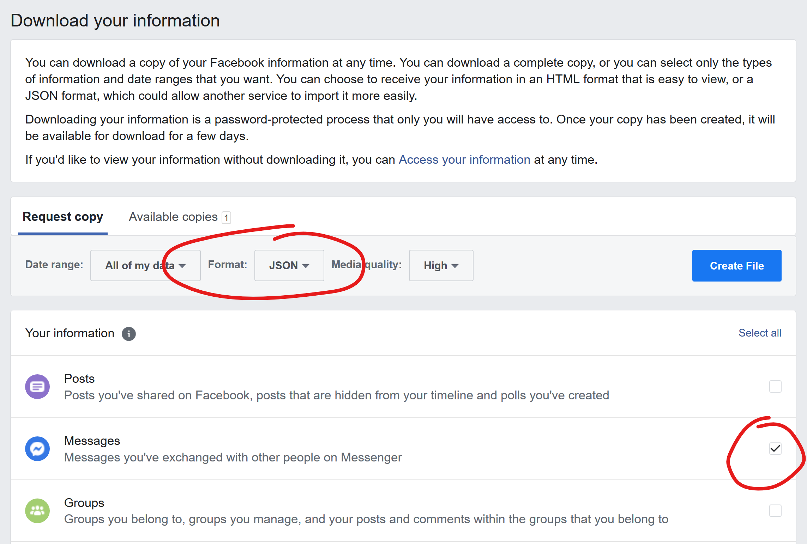

# ZuckerbergToSplunk

This script parses Facebook messages from a download archive that has been downloaded in JSON format. The output format is one JSON event per line that can be easily pushed into Splunk.

## Instructions
 * Download a Facebook archive from https://www.facebook.com/dyi  
 Make sure to download the messages in JSON format.  
 
 * Extract the "messages" folder into the root of this repo.
 * Run ./ConvertToSplunk.ps1 with [PowerShell](https://github.com/PowerShell/PowerShell)
 * Load the JSON file into Splunk with [oneshot via the CLI](https://docs.splunk.com/Documentation/Splunk/8.0.4/Data/MonitorfilesanddirectoriesusingtheCLI) or through "Add Data" in the web UI.